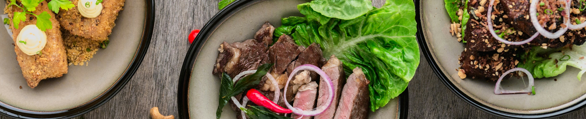

# recipes



<p align="center">
  <b>🍳  Every‑day recipes, auto‑generated & served over MCP  💡</b><br>
  <a href="https://recipes-alpha-ten.vercel.app/">Live Demo</a> ・
  <a href="#-quick-start">Quick Start</a> ・
  <a href="#-directory-structure">Directory Structure</a> ・
  <a href="#%EF%B8%8F-scripts">Scripts</a>
</p>


## 🔥 Features
| | |
|---|---|
| **One‑liner recipe scrape** | `pnpm run create-recipe <url>` — supports HTML pages *or* image‑only posts. |
| **LLM‑powered enrichment** | 調理時間 (`time`) とカロリー (`calories`) を自動推定して Front‑matter に追記。 |
| **VitePress Docs** | タグ・画像付きギャラリー、ダークモード完備。 |
| **MCP Server** | Claude for Desktop 等から「献立考えて！」🔨ツールを呼び出せるレシピ API。 |

## 🚀 Quick Start

```bash
git clone https://github.com/your‑org/recipes.git
cd recipes
pnpm i
```

### 1) レシピ生成（`package/`）

```bash
# 🍳 レシピファイルの作成
pnpm run create-recipe https://mi-journey.jp/foodie/36632/ \
  --output_dir=docs/recipes/
#=> docs/recipes/豚汁.md が自動生成
```

生成例（Front‑matter 抜粋）👇
```yaml
---
title: 豚汁
servings: 4
source: https://mi-journey.jp/foodie/36632/
tags: [時短レシピ, 汁物]
image: https://.../tonjiru_01.jpg
time: 30 
calories: 350
---
```

### 2) ドキュメントサイト（`docs/`）

```bash
pnpm run dev      # ホットリロード開発
pnpm run build    # dist 生成
pnpm run preview  # 静的ファイルの最終確認
pnpm run update   # レシピの更新
```

### 3) MCP サーバー（`mcp-server/`）

```bash
# レシピ JSON をシンボリックリンク
ln -s ./docs/.vitepress/recipes.json mcp-server/recipes.json

# サーバー起動
pnpm run start:mcp # stdio transport で起動
```

> Claude for Desktop の claude_desktop_config.json に下記を追加すれば
>「献立を考える」ツールとして利用できます 🛠️
> ```json
> {
>   "mcpServers": {
>     "menu": {
>       "command": "uv",
>       "args": [
>        "--directory",
>        "/ABSOLUTE/PATH/TO/YOUR/PROJECT",
>        "run",
>        "server.py"
>      ]
>     }
>   }
> }
> ```


## 🗂️ Directory Structure

```plaintext
.
├─ docs/                # VitePress 静的サイト
│  ├─ recipes/          # 生成された Markdown
│  └─ .vitepress/
│     └─ recipes.json   # MCP が読むマスター JSON
├─ package/             # create-recipe CLI
│  └─ scripts/
├─ mcp-server/          # FastMCP implementation
└─ README.md
```

---

## ⚙️ Scripts

| コマンド                                              | 説明                                            |
| ------------------------------------------------- | --------------------------------------------- |
| `pnpm run create-recipe <url> [--output_dir=...]` | レシピ Markdown を生成                              |
| `pnpm run update`                                 | `docs/.vitepress/recipes.json` を更新 |
| `pnpm run dev / build / preview`                  | VitePress サイト操作                               |
| `pnpm run start:mcp`                              | MCP サーバーを stdio で起動                           |

## LICENSE

MIT License
