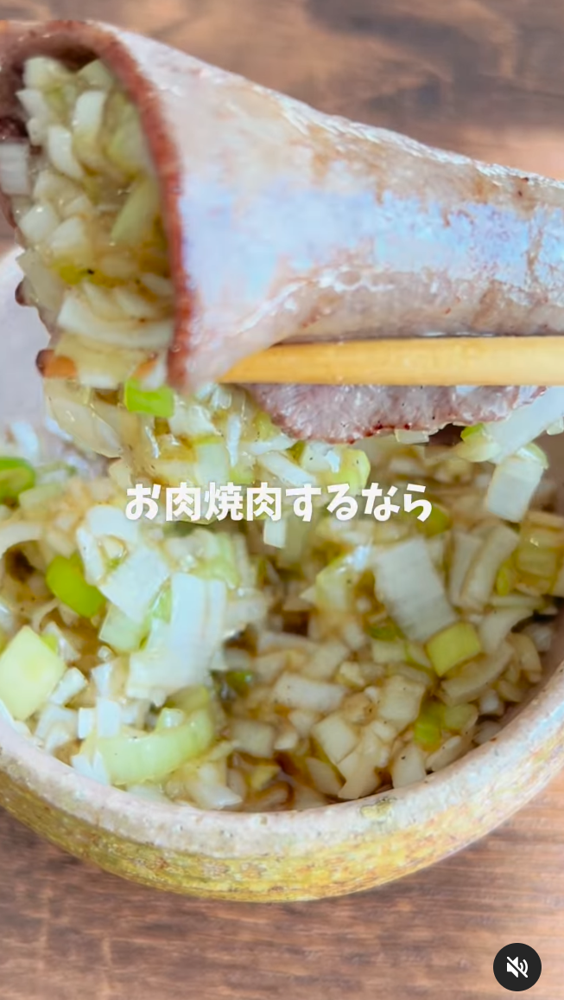

# 🍳 旨塩ねぎダレ

## 📝 備考
- 焼肉にも、冷奴や卵かけご飯にも万能なタレ
- 作るだけで食卓のテンション爆上がり
- ごま油の香りと塩味がクセになる！

## 🛒 材料（作りやすい量）
| 材料 | 分量 | 備考 |
|:---|:---|:---|
| 長ねぎ | 1本 | みじん切りにする |

### （A：合わせ調味料）
| 材料 | 分量 | 備考 |
|:---|:---|:---|
| ごま油 | 大さじ1 | |
| 鶏がらスープの素 | 小さじ1 | |
| 塩こしょう | 少々 | |
| オイスターソース | 少々 | |

## 🥣 手順

### 1. 長ねぎの準備
1. 長ねぎをみじん切りにする。

### 2. タレを作る
1. みじん切りした長ねぎと【A】をボウルに入れてよく混ぜ合わせる。
2. 完成！

## 💡 メモ・コツ
- 焼肉のたれ代わりに、冷奴のトッピングに、卵かけご飯にも相性抜群。
- 塩加減は好みで微調整するとよい。
- 作りたてよりも、少しなじませるとより美味しくなる。

